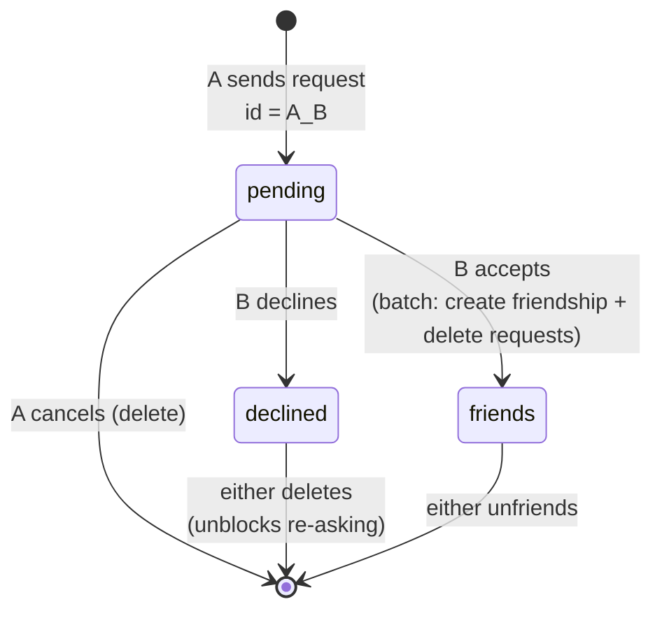
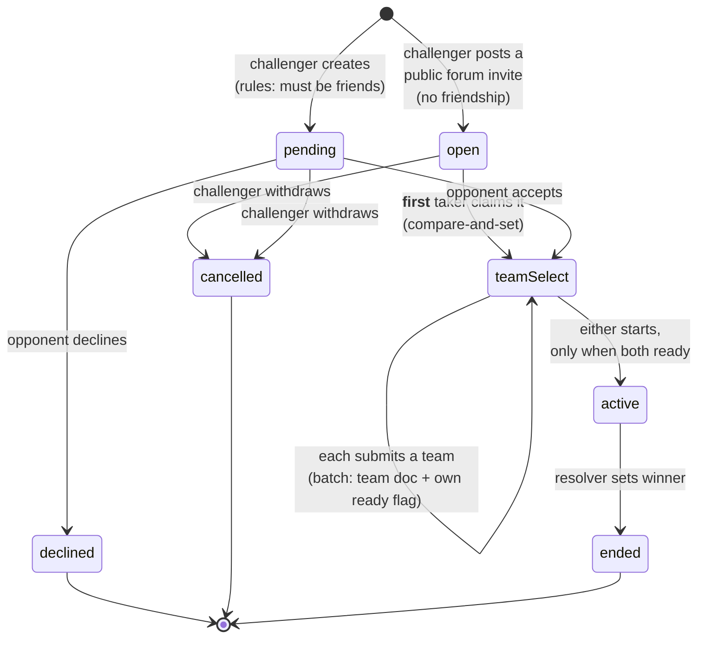
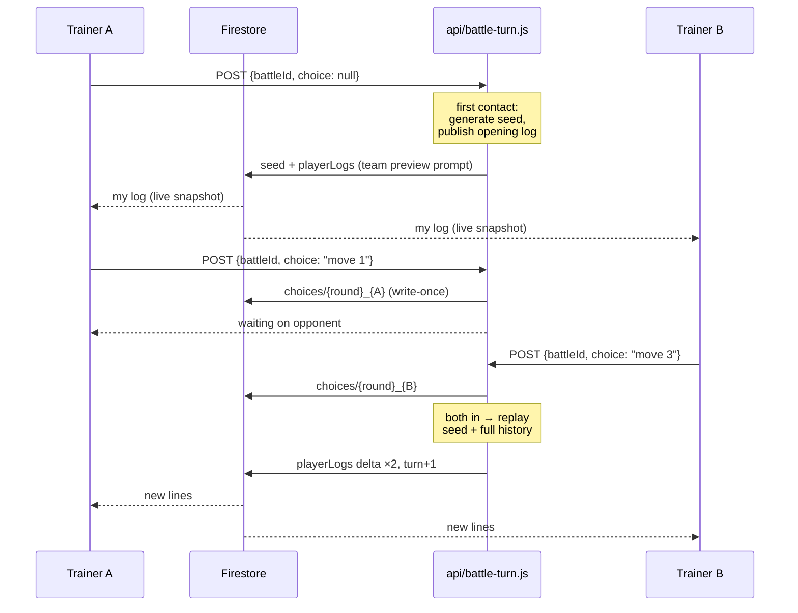

# How friends & async battles work

Companion to [the handoff](./HANDOFF-friends-and-battles.md) (status, blockers, traps) and
[the plan](./friends-and-async-battles.md) (decisions and the research behind them).
**This document explains the running system.**

---

## 1. The shape of it in one paragraph

Two trainers become friends through a public directory, then battle turn by turn with no
clock: either can submit a move whenever they open the app, and the turn resolves the
moment both have chosen. The battle is decided by the **real Pokémon Showdown simulator**
running inside a Vercel serverless function — never in the browser. Firestore stores only
the seed and the list of choices; the outcome is *recomputed* from those on every request,
which is what makes the whole thing replayable, auditable, and impossible for a player to
forge. Each player receives their own filtered view of the battle transcript, so neither
can read the other's EVs, items or movesets.

---

## 2. The pieces

```mermaid
flowchart TB
    subgraph Browser
        FV[FriendsView]
        BLV[BattleListView]
        BDV[BattleDetailView]
        BF[Battlefield<br/>animated sprites, HP bars]
        FS[useFriendsStore]
        BS[useBattlesStore]
        ST[battleState.js<br/>protocol → snapshot]
    end

    subgraph Firestore
        PP[(publicProfiles)]
        FR[(friendRequests)]
        FSH[(friendships)]
        B[(battles)]
        T[(battles/teams<br/>owner-read only)]
        PL[(battles/playerLogs<br/>owner-read only)]
        CH[(battles/choices)]
        PREFS[(users/uid/profile/preferences<br/>owner-read only)]
    end

    AUTH[(Firebase Auth<br/>uid → email)]

    subgraph Vercel
        EP[api/battle-turn.js]
        RES[battleResolver.js<br/>@pkmn/sim]
        NOT[battleNotify.js<br/>+ mailer.js]
    end

    FV --> FS --> PP & FR & FSH
    BLV & BDV --> BS
    BS --> B & T & CH
    PL -.live snapshot.-> BS --> ST --> BF
    BDV -- "POST choice + ID token" --> EP
    EP --> RES
    EP -- "admin SDK, bypasses rules" --> B & PL & CH & PP
    EP -- "awaitingUids, if not the caller" --> NOT
    NOT -- "admin SDK" --> AUTH & PREFS
    NOT -.SMTP.-> EMAIL[/opponent's inbox/]
```

The asymmetry is the point: the client **reads** the battle and **writes only its own
choice**. Everything that determines an outcome flows the other way, from the server.

---

## 3. Identity — who a trainer is publicly

Auth starts anonymous and upgrades via email link. Anything social requires the upgraded
account, enforced by `isUpgradedAccount()` in the rules — otherwise the directory fills
with throwaway uids that vanish on sign-out.

`artifacts/{appId}/publicProfiles/{uid}` is world-readable and holds only what the forum
already exposed: display name and avatar. Never an email.

**The avatar is resolved before it is stored.** A trainer has both a partner Pokémon and
(optionally) a Showdown trainer sprite, and picks which is their main one
(`avatarPreference`, kept in the *private* profile). `resolveAvatar()`
([src/utils/avatar.js](../../src/utils/avatar.js)) collapses that into exactly one of
`{trainerSprite}` or `{avatarPokemonId, avatarIsShiny}` — and *that* is what lands in the
public profile and in every denormalized copy (forum messages, battle docs). So no reader
ever needs to know the preference, and the rules needed no extra field.

`battleRecord: {wins, losses}` also lives here, but **the rules forbid a client from ever
changing it** — only the resolver's admin SDK moves it. A player cannot inflate their own
record.

---

## 4. Friendship — the state machine



Both ids are **deterministic**, which does a lot of work for free:

- `friendRequests/{from}_{to}` — the same pair can't produce a duplicate request, because
  it would be the same document.
- `friendships/{sortedA}_{sortedB}` — "are we friends?" is a single `get()`, no query. The
  rules enforce the canonical sort (`members[0] < members[1]`) so the id is collision-free.

**Accepting is order-sensitive, and inverting it deadlocks.** The rules only permit
creating a friendship *while a pending request exists*. So `acceptRequest` writes the
friendship **first** and clears the request(s) in the same `writeBatch`. Firestore
evaluates each write in a batch against the **pre-batch** state, so both pass; atomicity
means you can never end up with a friendship plus a stale request.

A declined request is **kept** as a `declined` document rather than deleted — the
deterministic id then stops the same trainer from instantly re-asking. Either party can
delete it to unblock. That's why `sendRequest`'s failure toast says *"you may already have
one pending"* instead of something generic.

---

## 5. Battle — the lifecycle



### Public invites — battling without a friendship

An invite is a battle document with **one** player and `status: 'open'`,
`isPublicInvite: true`, announced by a forum message that stores only its id. The
message never holds the invite's state, so every card in the thread shows the
live document and changes the instant somebody claims it.

Claiming is a **compare-and-set**, in both the client transaction and the rules:
the update is permitted only while `players` still has one entry and the caller
is not the challenger, so two people accepting at the same moment cannot both
win — the loser's write is rejected and they are told it was taken. From
`teamSelect` on it is an ordinary battle.

Direct challenges stay friends-only on purpose: an unsolicited battle from a
stranger is a spam vector, while nobody *receives* a public invite — people opt
into it. That asymmetry is the whole reason the friendship check could be
dropped for one path and not the other.

Clients own **only** this pre-battle lifecycle. `describeBattle(battle, userId)`
([src/utils/battle.js](../../src/utils/battle.js)) derives which buttons the viewer may
see, and it deliberately mirrors the transitions the rules allow — so the UI can never
offer an action the server would reject. Eight tests hold that line, including *"never
offer a pre-battle action once the battle is active"*.

Two things about teams:

- They live in `battles/{id}/teams/{uid}`, **owner-read only**. They cannot be a map on the
  battle document, because Firestore grants read access per *document* and never per
  field — a shared doc would hand each player the opponent's exact sets.
- They're stored as Showdown import text via `buildBattleTeamText()`, which strips the
  app's `@ Nothing` placeholder (the parser would otherwise create an item literally named
  "Nothing") and refuses a moveless Pokémon.

---

## 6. The turn loop — the heart of it



### Why it replays from scratch every time

The simulator is deterministic: the same seed plus the same sequence of choices produces
byte-identical output (asserted in `battleResolver.test.js`). So the only state worth
persisting is **the seed and the choices** — no serialized battle object, nothing that
breaks when the engine is upgraded. Every request rebuilds the battle from turn zero.

That's O(turns) per resolve — milliseconds for a few dozen turns — and it buys replays and
spectating for free, no state-migration problem, and an audit trail anyone can recompute.

### Three details that are easy to get wrong

**The opening must be published or the battle deadlocks.** At round 0 nobody has chosen, so
a pure request/response resolver returns early, writes no log — and with no log there's no
`|request|`, so no move buttons, so nobody *can* choose. `battle-turn.js` detects
`logSeq === 0` and publishes the opening replay with `advanceTurn: false`, handing both
players their team-preview prompt without resolving anything.

**The log is stored as deltas.** `replayBattle` always returns the transcript from turn
zero. Writing that whole thing each round would make every document repeat its
predecessors — the client concatenates rounds in order, so the transcript would show
everything twice and read cost would grow quadratically. `logLines: {p1, p2}` on the battle
doc tracks how many lines each side already has; only the slice past that offset is written.
This relies on a longer replay extending a shorter one line-for-line, which is asserted
directly ("replay logs extend, they do not rewrite").

**The seed is the server's alone.** A client flips `teamSelect → active` with `seed` still
null; the resolver fills it in on first contact. The rules give no client any path to write
it, so neither player can grind the RNG.

### Idempotency

Both clients may call the endpoint after either one moves. A choice is written with
`create` semantics — one per round per player, never overwritten. Resolution is guarded by
the round number: if the stored round already advanced past what we replayed, another
invocation won the race and we return the fresh state instead of writing twice.

### "Your turn" notifications — the same request, no cron job

Every time `publishLog` computes a fresh `awaitingUids`, `notifyAwaitingPlayer`
([api/lib/battleNotify.js](../../api/lib/battleNotify.js)) emails whichever of them is
**not the caller**. That single check — `pickAwaitingTarget` — is the entire throttle: the
caller just posted this very request, so they're necessarily in the app right now and
never need the nudge, while whoever *isn't* calling gets exactly one email per round that
becomes theirs. No cron job, no queue, no polling — the nudge rides the same request that
changed the state, both at the opening bootstrap (team preview) and at every later
resolution (skipped when the battle just ended).

The email's language comes from the recipient's own `artifacts/{appId}/users/{uid}/
profile/preferences` doc (`language: 'pt' | 'en'`) — read with the admin SDK, since a
battler's private prefs are otherwise owner-read-only. Their **address** comes from Admin
Auth (`getAdminAuth().getUser(uid).email`), not from Firestore — `publicProfiles` deliberately
never stores one. Sending itself
([api/lib/mailer.js](../../api/lib/mailer.js)) reuses the exact env vars
`api/send-admin-reply.js` already needs (`ADMIN_EMAIL_FROM`, `ADMIN_EMAIL_APP_PASSWORD`,
`SMTP_*`) — a deploy where admin replies already work needs no new secret for this.
Both the target-picking and the template-building are pure and tested
(`api/lib/battleNotify.test.js`); only the Firestore/Auth/SMTP calls around them are not,
matching how the resolver itself is split.

---

## 7. The security model

The single most important property: **a player can never read their opponent's hidden
sets, and can never decide an outcome.** Both fall out of the same rule — Firestore grants
read access per document, so anything private gets its own document keyed by uid.

| Path | Player (own) | Player (opponent's) | Resolver (admin SDK) |
|---|---|---|---|
| `publicProfiles/{uid}` | read, write (not `battleRecord`) | read | full |
| `friendRequests/{a}_{b}` | read, create, delete | read (if party) | — |
| `friendships/{a}_{b}` | read, create (needs pending request), delete | — | — |
| `battles/{id}` | read; only the 5 lifecycle transitions | read (+ **anyone** signed in, while `isPublicInvite`) | full |
| `battles/{id}/teams/{uid}` | read, write | **none** | full |
| `battles/{id}/playerLogs/{uid}/**` | read | **none** | write |
| `battles/{id}/choices/{round}_{uid}` | create once | read | full |
| `battles/{id}/chat/*` | read, create, delete own | read | — |

`seed`, `turn`, `winner`, `logSeq`, `logLines` and everything under `playerLogs` have **no
client-writable path at all**. The admin SDK bypasses rules, which is precisely why it's
the only thing that can move them.

The omniscient stream — the view that sees both sides — is **never stored**. A public
replay can be regenerated from the seed and choices whenever it's wanted.

---

## 8. The battlefield renderer

The client never loads the simulator. It reads its own protocol lines and derives what to
draw:

`myLog` (live from `playerLogs`) → `readBattleField()`
([src/utils/battleState.js](../../src/utils/battleState.js)) → `<Battlefield />`

The snapshot covers actives, HP, status, faints, roster, turn, weather and the outcome.
`|switch|p1a: Charizard|Charizard, L50, M|153/153` states the species, level, gender and HP
in one line, so no species database is needed.

Two figures worth remembering:

- **`@pkmn/img` — 42 KB gz, used.** Showdown's sprite filenames are not a mechanical slug:
  `Ho-Oh` → `hooh`, `Urshifu-Rapid-Strike` → `urshifu-rapidstrike`, while
  `Landorus-Therian` keeps its hyphen. Two broken images in a four-name spot check.
- **`@pkmn/client` + `@pkmn/dex` — 805 KB gz, rejected.** It's the "correct" library, but
  it can't track state without species data. Not modelled as a result: stat boosts,
  hazards, screens, volatiles. Adding them means extending `battleState.js` or accepting
  that 805 KB.

Sprites are hotlinked from Showdown and service-worker cached. **`` only** — the host
sends no CORS header, so `fetch()` or canvas will fail.

`@pkmn/*` has its own Rollup chunk. Left in `vendor` it rode along in the eager boot
bundle, costing every visitor ~40 KB for a feature most never open.

---

## 9. Where the code lives

| Concern | Module |
|---|---|
| Public directory + friend search | [`src/store/useFriendsStore.js`](../../src/store/useFriendsStore.js) |
| Friend listeners bound to the account | [`src/hooks/useFriends.js`](../../src/hooks/useFriends.js) |
| Avatar resolution (pure) | [`src/utils/avatar.js`](../../src/utils/avatar.js) |
| Battle lifecycle, teams, chat, choices | [`src/store/useBattlesStore.js`](../../src/store/useBattlesStore.js) |
| What the viewer may do (pure) | [`src/utils/battle.js`](../../src/utils/battle.js) |
| My prompt + readable transcript (pure) | [`src/utils/battleProtocol.js`](../../src/utils/battleProtocol.js) |
| Battlefield snapshot (pure) | [`src/utils/battleState.js`](../../src/utils/battleState.js) |
| Sprite URLs | [`src/utils/battleSprites.js`](../../src/utils/battleSprites.js) |
| Views | [`src/components/views/battle/`](../../src/components/views/battle/), [`FriendsView.jsx`](../../src/components/views/FriendsView.jsx) |
| **The engine** | [`api/lib/battleResolver.js`](../../api/lib/battleResolver.js) |
| The endpoint | [`api/battle-turn.js`](../../api/battle-turn.js) |
| Server auth + admin Firestore + admin Auth | [`api/lib/serverAuth.js`](../../api/lib/serverAuth.js) |
| "Your turn" email — who to notify, what it says (pure) + sending | [`api/lib/battleNotify.js`](../../api/lib/battleNotify.js), [`api/lib/mailer.js`](../../api/lib/mailer.js) |
| Permissions | [`firestore.rules`](../../firestore.rules) |

The heavy logic is pure and outside the stores on purpose — that's what makes 77 tests
possible without Firebase or a browser.

---

## 10. Invariants — break these and it breaks quietly

1. **One document per reader for anything private.** Rules can't hide a field. This trap
   has already been hit twice (the teams map, then the shared log doc).
2. **The engine never ships to the browser.** It lives in `api/`. The check is grepping the
   built bundle for `BattleStream` / `@pkmn/sim`.
3. **`@pkmn/sim` stays pinned exactly** (no caret) and stamped on the battle as
   `engineVersion`. A minor bump can change turn outcomes and break an in-flight replay.
4. **`describeBattle` must mirror the rules.** If they diverge, the UI offers buttons the
   server rejects. It now describes an unclaimed public invite *before* resolving an
   opponent, because there isn't one yet — returning null there would hide the invite from
   its own author's battle list.
9. **A public invite is world-readable by design.** Its document carries no secret (teams,
   logs and choices are subcollections with owner-only rules), and the seed it holds is
   already visible to both players — a spectator learning it grants no power, since only
   the two players can write a choice. Do not move anything private onto the battle
   document without revisiting that read rule.
5. **Accept-friend writes the friendship before clearing the request.** Inverting it
   deadlocks every accept.
6. **The log write path stays delta-based.** Keep the "replay logs extend" tests green.
7. **A battle-only dependency gets its own chunk.** `manualChunks` otherwise buries it in
   the eager boot bundle.
8. **The "your turn" nudge only ever targets a non-caller.** `pickAwaitingTarget` is the
   whole anti-spam mechanism; removing that check would email someone for their own move.

---

## 11. Next steps

### First — drive one real battle (nothing else is blocked on code)

The turn loop and the renderer have never been exercised end to end. After setting the
Vercel env vars (handoff §4):

1. Open the existing battle — it has no `logSeq`, so the bootstrap fires and team preview
   should appear.
2. Confirm order → moves → a winner. Watch that **the transcript doesn't repeat lines**
   (the delta path) and that both HP bars track.
3. Watch the sprites. A missing one means `@pkmn/img` resolved a name Showdown has no gif
   for; `onError` hides it rather than showing a broken image, so check the network tab.
4. Check `battleRecord` incremented on both profiles at the end.

### Then — Phase 5, roughly in value order

| Item | Notes |
|---|---|
| **"Your turn" notification** | ✅ **Done.** `api/lib/battleNotify.js` emails whichever side of a fresh `awaitingUids` isn't the caller, on every bootstrap and resolution. Untested in production — needs a real two-account battle to confirm delivery (see §11 "drive one real battle"), and `ADMIN_EMAIL_APP_PASSWORD`/`ADMIN_EMAIL_FROM` must already be set in Vercel (same vars `send-admin-reply.js` needs — no new secret if admin replies already work). |
| **Abandoned-battle timeout** | Same `awaitingChoiceFrom` field plus `lastActivityAt`. Decide the policy — auto-forfeit, or just mark it stale. |
| **Public replays** | Nearly free: regenerate the omniscient stream from the seed and choices. Needs a read-only route and a rule for finished battles. |
| **Spectating** | The same regeneration, live. Decide whether friends-only. |
| **W/L on profiles** | The resolver already increments it; it just isn't surfaced in the UI. |
| **Move animations** | Pure polish. |

### Deferred, with the trade already measured

- **Boosts / hazards / screens / weather effects on the battlefield** — extend
  `battleState.js`, or accept `@pkmn/client`'s 805 KB.
- **Real formats (`gen9ou`, VGC) and doubles** — the sim validates teams for 54 gen-9
  formats out of the box; the work is a challenge-time dropdown plus doubles targeting in
  the renderer.
- **Per-Pokémon level** — everything is level 50 today.

### Independent debt worth a pass

- **`buildShowdownExportText` emits `Name @ Nothing`** for an item-less Pokémon. That's
  invalid Showdown for the user-facing "copy team" feature too — anyone pasting it gets a
  bogus item. Battles work around it in `buildBattleTeamText()`. The fix is to omit the
  `@ …` part and update the assertion at `showdownExport.test.js:69`.
- **`npm run lint` fails on 57 pre-existing errors** across 23 files. None come from this
  work, but the gate is meaningless until they're cleared.
- **No rules tests.** The two rule bugs found so far both surfaced at runtime.
  `@firebase/rules-unit-testing` plus the emulator would have caught them; that needs Java
  installed locally.
